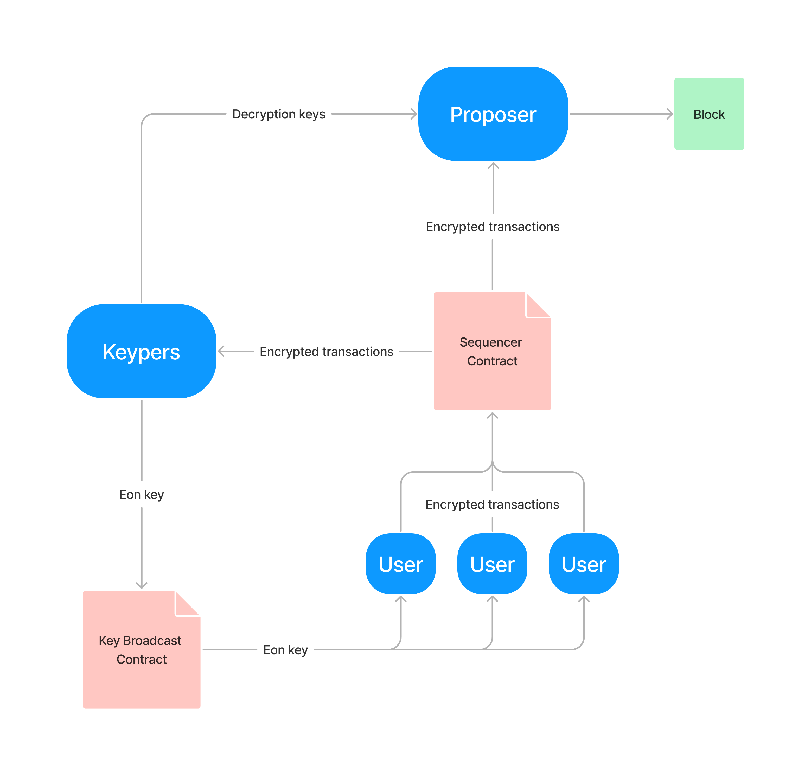
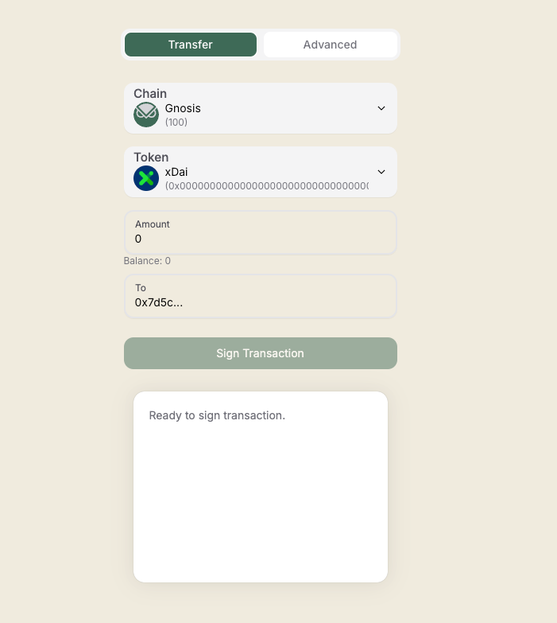

# Gnosis Shutter App

## Overview

Gnosis Shutter enhances transaction privacy and security on the Gnosis Chain. It allows users to encrypt their transactions to prevent frontrunning and censorship, with decryption and execution only occurring when they are ready to be included in a blockchain block.

## Features

- **Encryption of Transactions**: Users can encrypt transactions using a public 'eon key' before submission.
- **Decentralized Decryption**: Managed by a group of nodes called keypers, who ensure secure transaction decryption.
- **Enhanced Security**: Transactions are decrypted only when they are ready to be included in a block, enhancing security and privacy.
- **Opt-in System**: Users can choose between sending encrypted transactions or using the standard plaintext format.
- **Shutter Timer**: Track when next shutter validator will include transactions from sequencer to the block. 





## Getting Started

### Prerequisites

- Node.js (version 22.3.0)
- A compatible wallet (e.g., Brave Wallet)

### Installation

1. Clone the repository:
   ```bash
   git clone https://github.com/yourusername/gnosis-shutter.git
   cd gnosis-shutter
   ```
   
2. Install dependencies:
   ```bash
    npm install
    ```

3. Configure environment variables:
    ```bash
    cp .env.example .env
    ```

Running the Application
To start the application, run the following command:
```bash
npm run dev
```

## Usage
To submit an encrypted transaction:

1. Connect your Brave Wallet.
2. Select the Gnosis Chain or Chiado.
3. Choose transfer tokens or advanced transaction (you need to copy build transaction from metamask)
4. Sign transaction.
5. Submit transaction to shutter sequencer contract.

Transactions will be encrypted client-side and sent to the Sequencer Contract for processing.

## Documentation
For more detailed information about the Gnosis Shutter system and its components, visit the following links:
* [Shutter Network](https://www.shutter.network/).
* [Shutterized Gnosis Chain -- High Level Overview](https://github.com/gnosischain/specs/blob/master/shutter/high-level.md)
* [Shutterized Gnosis Chain -- Low Level Specification](https://github.com/gnosischain/specs/blob/master/shutter/low-level.md)

## Support

If you need help or have any questions, please file an issue [here](https://github.com/gnosischain/shutter-encryption/issues).
